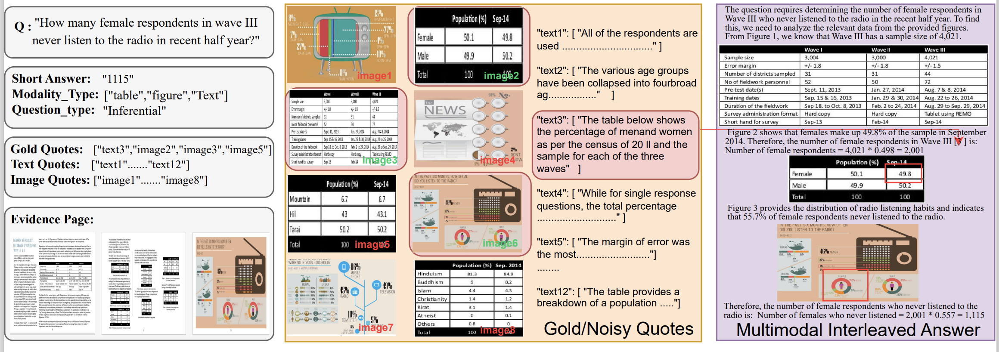

<p align="center">
  <h1 align="center">MMDocRAG: Benchmarking Retrieval-Augmented Multimomal Generation for Document Question Answering</h1>
    <p align="center">
    <strong>Kuicai Dong</strong></a>
    ·
    <strong>Yujing Chang</strong>
    ·
    <strong>Shijie Huang</strong>
    ·
    <a href="https://scholar.google.com/citations?user=x-UYeJ4AAAAJ&hl=en"><strong>Yasheng Wang</strong></a>
    ·
    <a href="https://scholar.google.com/citations?user=fUtHww0AAAAJ&hl=en"><strong>Ruiming Tang</strong></a>
    ·
    <a href="https://stephenliu0423.github.io/"><strong>Yong Liu</strong></a>
  </p>
  <!-- <h2 align="center">Submitted to arXiv</h2> -->
  📖<a href="https://arxiv.org/abs/2407.01523">Paper</a> |🏠<a href="https://mayubo2333.github.io/MMLongBench-Doc/">Homepage</a></h3>|🤗<a href="https://huggingface.co/datasets/yubo2333/MMLongBench-Doc">Huggingface</a></h3>
<div align="center"></div>
<p align="center">
  <p>
Document Visual Question Answering (DocVQA) faces dual challenges in processing lengthy multimodal documents (text, images, tables) and performing cross-modal reasoning. Current document retrieval-augmented generation (DocRAG) methods remain limited by their text-centric approaches, frequently missing critical visual information. The field also lacks robust benchmarks for assessing multimodal evidence integration and selection. We introduce MMDocRAG, a comprehensive benchmark featuring 4,055 expert-annotated QA pairs with multi-page, cross-modal evidence chains. Our framework introduces innovative metrics for evaluating multimodal quote selection and enables answers that combine text with relevant visual elements. Through large-scale experiments with 55 language/vision models and 14 retrieval systems, we identify persistent challenges in multimodal evidence handling. Key findings reveal proprietary vision-language models show
moderate advantages over text-only models, while open-source alternatives trail significantly. Notably, fine-tuned LLMs achieve substantial improvements when using detailed image descriptions. MMDocRAG establishes a rigorous testing ground and provides actionable insights for developing more robust multimodal DocVQA systems.
  </p>
  <a href="">
    
  </a>
<br>


## 🛠️Dataset Usage

### 1. For Inference using API

#### API Key Preparation

We support inference from the API providers as follows:

- For Google Gemini key, please visit https://ai.google.dev/gemini-api/docs/api-key
- For Anthropic key, please visit https://console.anthropic.com/settings/keys
- For OpenAI key, please visit https://platform.openai.com/api-keys
- For Alibaba Cloud Qwen key, please visit https://bailian.console.aliyun.com/?tab=api#/api
- For Deepinfra key, please visit https://deepinfra.com/dash/api_keys

#### Inference Command

You can infer using the command:

```bash
python inference_api.py qwen3-32b --setting 20 --mode pure-text --no-enable-thinking
```

>The model name for example "qwen3-32b", is compulsory.
>
>`--setting` parameter is to pass either 15 or 20 quotes for evaluation.
>
>`--mode` parameter is to control passing quotes as either pure-text or multimodal inputs.
>
>`--no-enable-thinking` parameter is to disable thinking process for Qwen3 model, which does not applicable to non-Qwen3 models.

### 2. For Inference using Checkpoints

#### Environment

```
python 3.9
2.1.2+cu121
ms-swift
```

#### Inference Command

You can infer using the command:

```bash
python inference_checkpoint.py Qwen2.5-7B-Instruct --setting 20 --lora Qwen2.5-7B-Instruct_lora
```

>The model checkpoint ID (same as huggingface repo name), for example "Qwen2.5-7B-Instruct", is compulsory.
>
>`--setting` parameter is to pass either 15 or 20 quotes for evaluation.
>
>`--lora` parameter is for loading pre-trained checkpoint with fine-tuned LoRA weights.

### 3. For Finetuning Models

You can initialize the model training using the command.

```bash
python train_swift_qwen.py Qwen2.5-7B-Instruct
```

>The model checkpoint ID (same as huggingface repo name), for example "Qwen2.5-7B-Instruct", is compulsory.
>
>`--setting` parameter is to pass either 15 or 20 quotes for evaluation.

LoRA weights will be saved to path `Qwen2.5-7B-Instruct_lora`


## 🔮Dataset Evaluation - yujing

### 1. LLM-as-Judge

You can evaluate the generated multimodal answer using the command:

```bash
python eval_llm_judge.py response/qwen3-4b_pure-text_response_quotes20.jsonl --setting 20
```

>The path of the response jsonl generated by `inference_api.py` or `inference_checkpoint.py`, for example `response/qwen3-4b_pure-text_response_quotes20.jsonl`, is compulsory.
>
>`--setting` parameter is to pass either 15 or 20 quotes for evaluation.

This will generate new jsonl file with detailed qualitative scores by LLM-Judge.

### 2. All Scores

This is to generation all scores: quotes selection F1, BLEU, ROUGE-L, and LLM-as-Judge scores (if applicable).

You can evaluate the generated multimodal answer using the command:

```bash
python eval_all.py --path response/qwen3-4b_pure-text_response_quotes20.jsonl --setting 20 --path_judge xxx/xxx.jsonl
```

>`--path_response` parather is  the path of the response jsonl generated by `inference_api.py` or `inference_checkpoint.py`, for example `response/qwen3-4b_pure-text_response_quotes20.jsonl`, is compulsory.
>
>`--path_judge` parameter is the path of LLM-Judge scores generated by `eval_llm_judge.py`. 
>
>`--setting` parameter is to pass either 15 or 20 quotes for evaluation.
>
>If `--llm-judge` is enabled but no related scores can be found, LLM-as-Judge scores will not be shown.


**代码逻辑**是：

- 如果用户输入的是path_response，就根据path去评估
  - 如果path_judge一起提供了，就合在一起给分数
- 如果用户输入的是model，那就根据model，setting，mode去找我们开源的jsonl文件，去评估


## ☀️Reproducing Our Results - yujing

We have released all our inference and LLM-Judge jsonl results for 30 open-source, 25 proprietary, 5 sft models.

- `./response/` for inference
- `./xxx/` for LLM-Judge scores (yujing确认一下，inference跟llm打分是不是在同一个文件？)

You can reproduce the results in our paper by using the command:

```bash
python eval_all.py --model qwen3-4b --setting 20 --mode pure-text
```

>`--model` parameter is the model identifier used in our paper, for example "qwen3-32b".
>
>`--setting` parameter is to pass either 15 or 20 quotes for evaluation.
>
>`--mode` parameter is to control passing quotes as either pure-text or multimodal inputs.

This will generate new jsonl file with detailed qualitative scores by LLM-Judge.

Available commands are stored in `./xxx/xxx.txt`


## 💾Citation
```
to be updated
```


## 📄 License

  **Usage and License Notices**: The data and code are intended and licensed for research use only.
License: Attribution-NonCommercial 4.0 International It should abide by the policy of OpenAI: https://openai.com/policies/terms-of-use